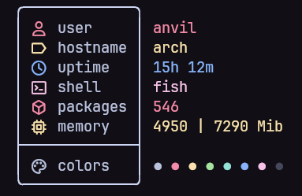
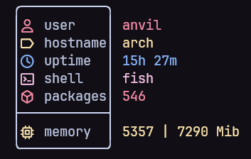
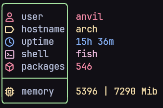
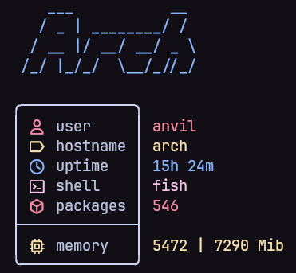

# TinyFetch

_**Custom system info for terminals**_ ✨

TinyFetch is a lightweight, Go-based utility designed to display system information such as OS, kernel, CPU, memory, and more. Its strength lies in its extensive customization options, allowing users to tailor the output's appearance and content through a YAML configuration file. 🛠️

## Features 📋
- 📝 **Flexible Configuration**: Customize title, layout, and modules via YAML.
- 🐧 **Linux Support**: Optimized for Linux environments.
- 🎨 **Rich Styling**: Fine-tune colors, margins, and borders.
- 🧩 **Modular Output**: Choose and style system info modules.

## Gallery 📸







## Installation ⚙️

### Dependencies
- `curl` or `wget` (required for downloading the binary).
- A compatible Linux operating system.

### Install via curl
```bash
curl -L https://github.com/AnvilM/tinyfetch/releases/latest/download/tinyfetch -o tinyfetch && chmod +x tinyfetch && sudo mv tinyfetch /usr/bin/
```

### Install via wget
```bash
wget https://github.com/AnvilM/tinyfetch/releases/latest/download/tinyfetch -O tinyfetch && chmod +x tinyfetch && sudo mv tinyfetch /usr/bin/
```

## Usage
Display system information by running:
```bash
tinyfetch
```

## Configuration

TinyFetch is configured through a YAML file located at `~/.config/tinyfetch/config.yml`. This file defines the structure and appearance of the output, including the title, container layout, and system information modules. At least one module must be specified in the `modules` section for the configuration to be valid.

### Configuration File Structure

The configuration file follows a structured YAML format with the following top-level keys:

- **`title`**: Configures the title text displayed at the top.
- **`container`**: Defines the layout and styling of the output container.
- **`modules`**: Specifies an array of system information modules (required, with at least one module).

Below is a detailed breakdown of each section.

#### Title
The `title` section customizes the appearance of the title text, typically used for ASCII art or a custom header.

| Field      | Type   | Required | Default | Example                     | Description                                      |
|------------|--------|----------|---------|-----------------------------|--------------------------------------------------|
| `filePath` | String | No       | none    | `~/.config/tinyfetch/title.txt` | Path to a file containing the title text (e.g., ASCII art). |
| `color`    | String | No       | white   | `cyan`                      | Color of the title text. See [Colors](#colors) for available options. |

#### Container
The `container` section controls the layout and styling of the output container, including margins, padding, and borders.

| Field          | Type   | Required | Default | Example | Description                                      |
|----------------|--------|----------|---------|---------|--------------------------------------------------|
| `marginLeft`   | Integer | No      | 2       | `4`     | Number of spaces for the left margin.            |
| `marginRight`  | Integer | No      | 1       | `2`     | Number of spaces for the right margin.           |
| `paddingLeft`  | Integer | No      | 1       | `2`     | Number of spaces for the left padding.           |
| `paddingRight` | Integer | No      | 1       | `2`     | Number of spaces for the right padding.          |
| `borderColor`  | String  | No      | white   | `blue`  | Color of the container border. See [Colors](#colors) for available options. |

#### Modules
The `modules` section is an array of objects, each representing a system information module to display. This section is **required**, and at least one module must be defined. Each module object specifies the type of information, its label, and styling.

| Field         | Type   | Required | Default         | Example   | Description                                      |
|---------------|--------|----------|-----------------|-----------|--------------------------------------------------|
| `type`        | String | Yes      | N/A             | `os`      | Type of system information to display. See [Module Types](#module-types) for available options. |
| `label`       | String | No       | Value of `type` | `OS`      | Custom text label for the module.                |
| `labelColor`  | String | No       | white           | `green`   | Color of the label text. See [Colors](#colors) for available options. |
| `infoColor`   | String | No       | white           | `cyan`    | Color of the module's data output (e.g., "5h 0m" for uptime). See [Colors](#colors) for available options. |
| `prefix`      | String | No       | "" (empty)      | `->`      | Optional prefix before the label.                |
| `prefixColor` | String | No       | white           | `yellow`  | Color of the prefix. See [Colors](#colors) for available options. |

#### Colors
The following colors are supported for `color`, `borderColor`, `labelColor`, `infoColor`, and `prefixColor` fields:
-:-

- `black`
- `red`
- `green`
- `yellow`
- `blue`
- `magenta`
- `cyan`
- `white`

#### Module Types
The following module types are available for the `type` field in the `modules` section:
- `user`: Displays the current username.
- `hostname`: Shows the system hostname.
- `os`: Displays the operating system name and version.
- `kernel`: Shows the kernel version.
- `uptime`: Displays system uptime.
- `shell`: Shows the current shell.
- `packages`: Lists the number of installed packages.
- `memory`: Displays memory usage.
- `colors`: Shows a color palette for reference.

### Example Configuration
Below is an example `config.yml` that demonstrates the configuration of a title, container, and multiple modules:

```yaml
title:
  filePath: ~/.config/tinyfetch/title.txt
  color: cyan
container:
  marginLeft: 4
  marginRight: 2
  paddingLeft: 2
  paddingRight: 2
  borderColor: blue
modules:
  - type: os
    label: Operating System
    labelColor: green
    infoColor: white
    prefix: "=>"
    prefixColor: yellow
  - type: uptime
    label: Uptime
    labelColor: magenta
    infoColor: cyan
    prefix: "=>"
    prefixColor: yellow
  - type: memory
    label: Memory
    labelColor: red
    infoColor: white
    prefix: "=>"
    prefixColor: yellow
```
## Credits 💌

Thanks to: [**`Nitch`**](https://github.com/ssleert/nitch)

## License
This project is licensed under the MIT License. See the [LICENSE](LICENSE) file for details.